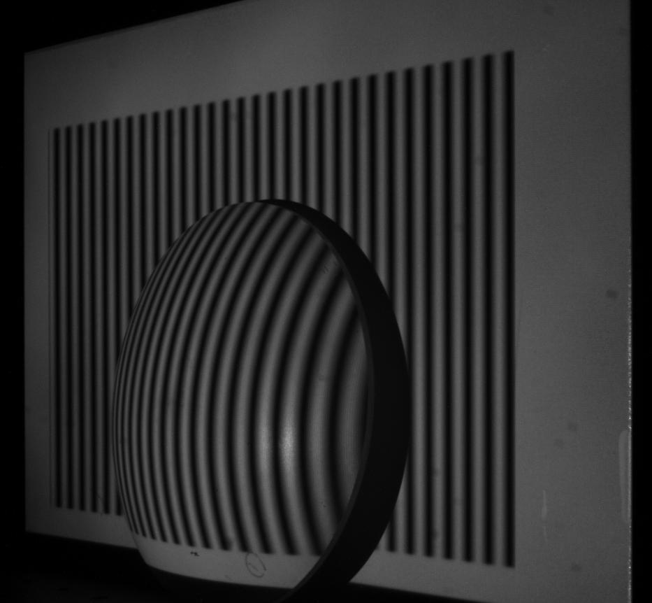
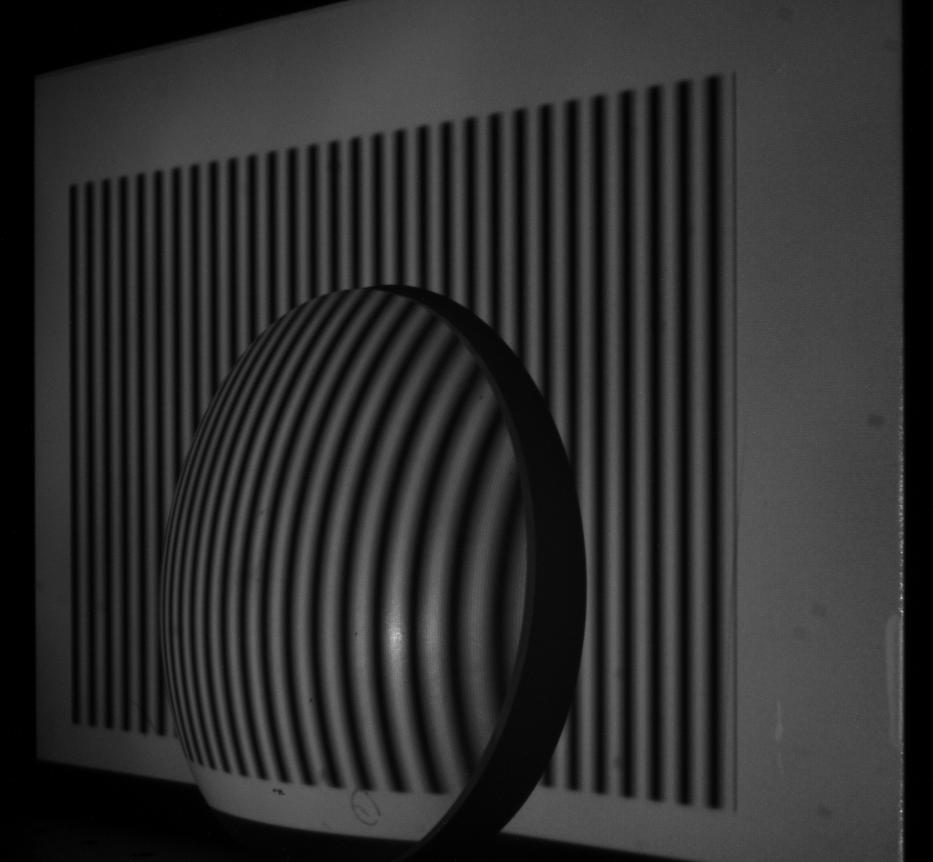
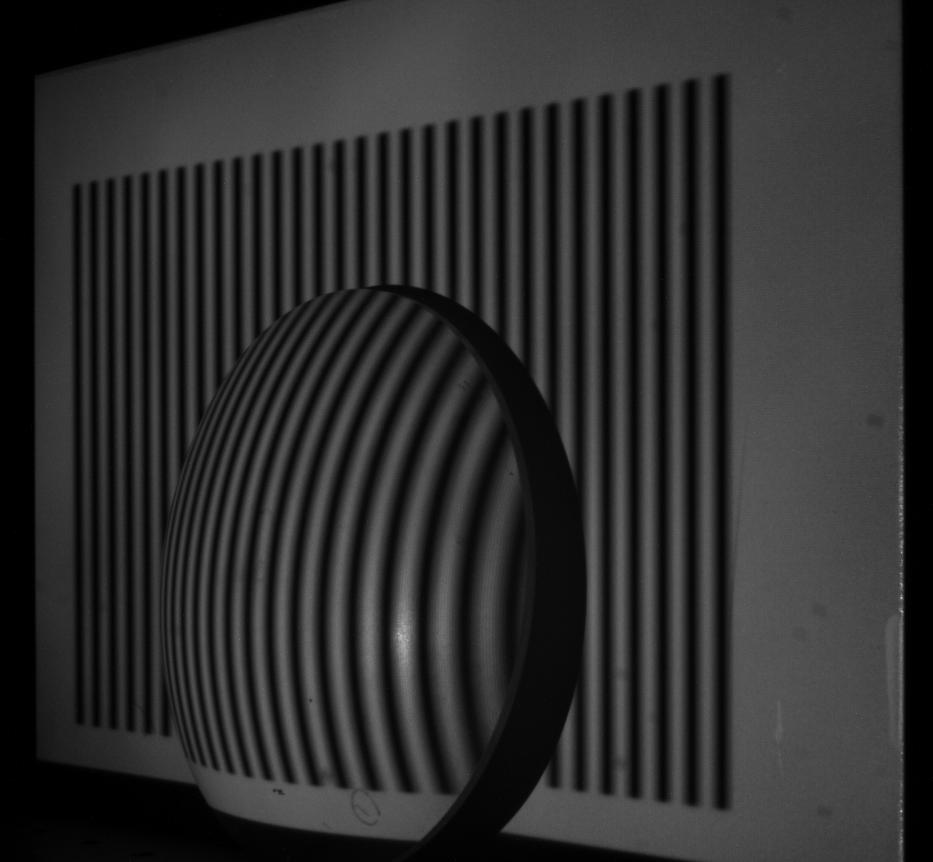
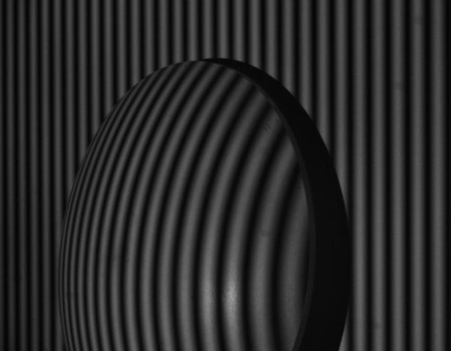
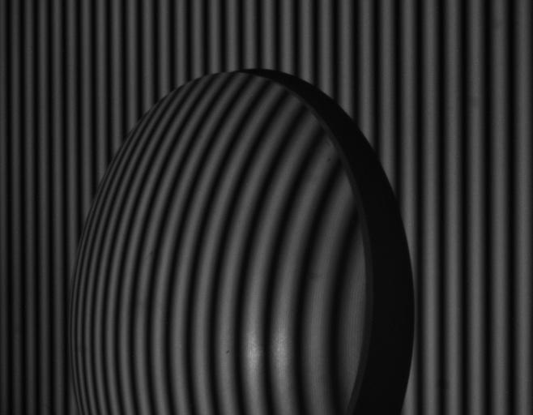
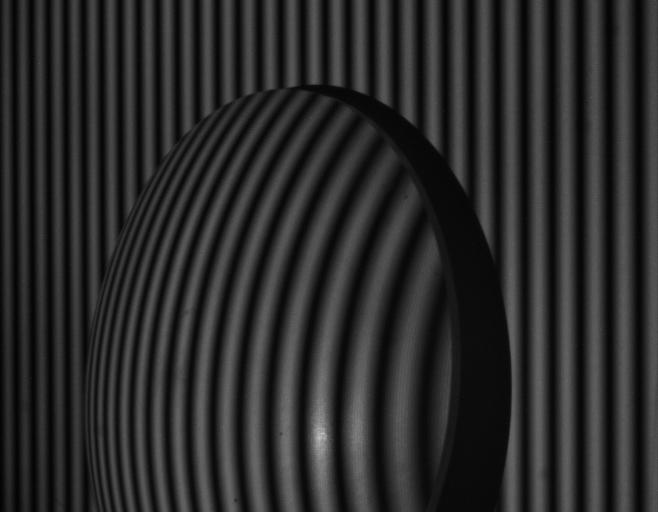
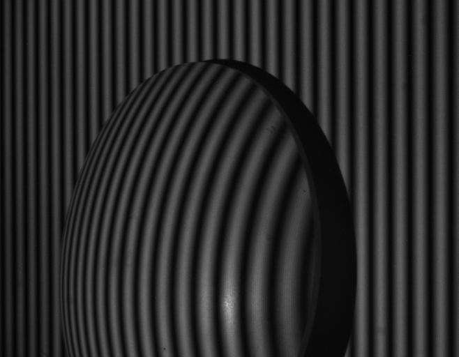

# Fringe Projection Profilometry

This repository contains a collection of tools for doing fringe projection profilometry (FPP) --- projecting sinusoidal fringes onto an object and observing the resulting pattern with a camera. By projecting a sequence of fringes with different phase shifts, and saving an image at each step, we can measure the height profile of the object.

The set of images below show a conventional set of fringe projection images, using phase shift values of 0, 90, 180, and 270deg. We will call these images $I_0$, $I_1$, $I_2$, and $I_3$.

<table style="width:100%">
    <tr>
        <td style="text-align:center"> </td>
        <td style="text-align:center"> </td>
        <td style="text-align:center"> </td>
        <td style="text-align:center"> </td>
    </tr>
</table>

We can see that some areas within the images do not contain fringes. While some FPP algorithms can handle this without trouble, some cannot. So, we crop the images down to the fringe-only region, such as shown here:

<table style="width:100%">
    <tr>
        <td style="text-align:center"> </td>
        <td style="text-align:center"> </td>
        <td style="text-align:center"> </td>
        <td style="text-align:center"> </td>
    </tr>
</table>

The conventional FPP algorithm takes these four shifts and estimates the object bias $B$, modulation contrast $C$, and phase $\phi$ with

$B = \frac{1}{4} \big( I_0 + I_1 + I_2 + I_3 \big), \quad C = \frac{1}{2} \big[ (I_1 - I_3)^2 + (I_0 - I_2)^2 \big]^{1/2}, \qquad \phi = \mathrm{arctan} \Big( \frac{I_1 - I_3}{I_0 - I_2} \Big)$  

The arctangent function will produce a **wrapped** phase. Once we unwrap this, we get a steadily increasing (or decreasing) function. When viewing a flat object, the unwrapped phi should be a tilted plane. This approach is calculated using the `fpp_4frames()` function.

If we take a sequence of images without an object, and then a second sequence with an object placed in front of the background, then the difference $\Delta \phi$ between these two phase images gives us the height $z$ of the object in units of radians.

In order to translate the height in radians to a physical unit (such as mm), we use
$$z = \frac{L_0 \Delta \phi}{\Delta \phi - 2 \pi f_0 d}$$  
where $f_0$ is the spatial frequency of the fringes, $L_0$ is the distance from the camera to the object reference plane, and $d$ is distance between the projector and camera pupils. If we measure the fringe spacing from one peak to the next as 20.8 mm, then the fringe spatial frequency will be $f_0 = 1 / 20.8 \mathrm{mm} = 0.048 \ \mathrm{mm}^{-1}$.

## Using fringe projection images with N uniformly-spaced phases

The above algorithm for calculating $\phi$ assumed that we had 4 images with phase shifts equally spaced in 90deg intervals. A disadvantage of this is that if there is uncorrected nonlinearity in the intensity of the projector-camera system, then the estimated profile shows large ripples characteristics of this error. One easy way of reducing the ripple error, without actually having to calibrate the projector+camera, is to use a larger number of images, such as $N = 8$. In this case we need a different algorithm to estimate the bias, contrast, and wrapped phase:

$B (x,y) = \frac{1}{N} \sum I_n (x,y)$  
$C (x,y) = \frac{2}{N} \bigg( \big[ \sum_n I_n (x,y) \sin (2 \pi n/N) \big]^2 + \big[ \sum_n I_n (x,y) \cos (2 \pi n/N) \big]^2 \bigg)^{1/2}$  
$\phi (x,y) = \text{arctan} \bigg( \frac{\sum_n I_n (x,y) \sin (2 \pi n / N)}{\sum_n I_n (x,y) \cos (2 \pi n / N)} \bigg)$  

## Using fringe projection images with 4 nonuniformly spaced phases

A nice paper worked out how to generalize all of the FPP algorithms for nonunifom fringe spacing:

>    G. A. Ayubi, C. D. Perciante, J. L. Flores, J. M. D. Martino, and J. A. Ferrari, "Generation of phase-shifting algorithms with N arbitrarily spaced phase-steps," Applied Optics 53:7168-7176 (2014).

Before giving the algorithm in its most general form, I will give the calculation for 4 phases, which is easily verified against the standard 4-frame algorithm:

$\phi (x,y) = \text{arctan} \bigg( \frac{(I_1 - I_3) [\cos \delta_2 - \cos \delta_4] - (I_4 - I_2) [\cos \delta_1 - \cos \delta_3]}{(I_1 - I_3) [\sin \delta_2 - \sin \delta_4] - (I_4 - I_2) [\sin \delta_1 - \sin \delta_3]} \bigg)$  

## Using fringe projection images with N unknown phases

To further generalize this, what if we are doing FPP but don't actually know the phase relationships from the projector. Believe it or not, this is actually an important case for our research. There is a clever way of doing this developed in

>    Zhaoyang Wang and Bongtae Han, "Advanced iterative algorithm for phase extraction of randomly phase-shifted interferograms," Optics Letters 29:1671-1674 (2004).

The script `fpp_unknown_shifts.py` gives an example of this algorithm, using the above set of four images.

## Using fringe projection N known but nonuniform phases

This really just amounts to using the $\delta$'s estimated from the step above, inserting them into the least-squares algorithm for estimating $\phi (x,y)$, and instead of iterating back and forth between the two, running the estimation function only once.
